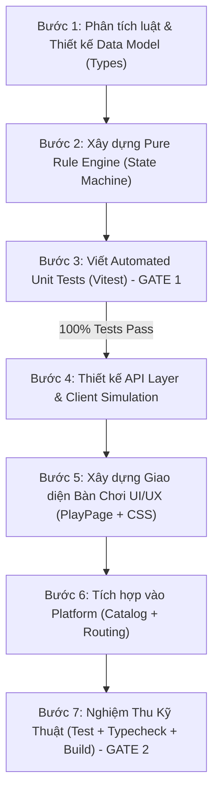

# Quy Trình Chuẩn (SOP): Phát Triển & Tích Hợp Game Mới Vào BoardVerse

Tài liệu này là cẩm nang hướng dẫn thực thi (runbook) chuẩn mực dành cho AI Agent và lập trình viên khi phát triển một board game mới trên nền tảng **BoardVerse (`partygameonline-platform`)**.

> [!IMPORTANT]
> Quy trình này được đúc kết từ lịch sử phát triển thực tế của các tựa game **Night of Bloodlines (`nob`)**, **Where's the Bone**, **Not In My Pot!**, và **Blood Bound (`blood-bound`)**.
> **Nguyên tắc bất di bất dịch:** Luôn tuân thủ phương châm **Logic-First & Automated Tests Before UI**.

---

## Tổng Quan 7 Bước Thực Hiện



---

## 🛠️ Công Cụ Hỗ Trợ Tự Động: Scaffolding Script

Trước khi bắt đầu, hãy sử dụng script sinh mã tự động để tạo sẵn toàn bộ khung thư mục chuẩn mực:

```bash
# Cú pháp
npm run scaffold:game <game-id> "<Game Display Name>"

# Ví dụ
npm run scaffold:game spyfall "Spyfall (Gián Điệp)"
npm run scaffold:game coup "Coup (Đảo Chính)"
```

Lệnh này sẽ tự động tạo đủ cấu trúc module tại `apps/web/src/games/<gameId>/` với đầy đủ 7 files:
1. `model/<gameId>Types.ts`
2. `model/<gameId>Rules.ts`
3. `model/<gameId>Rules.test.ts` (kèm test mẫu chạy được ngay)
4. `api/<gameId>Api.ts`
5. `pages/<GameName>PlayPage.tsx`
6. `pages/<GameName>PlayPage.module.css`
7. `index.ts`

---

## Chi Tiết Từng Bước Trong Quy Trình

### Bước 1: Phân Tích Luật Chơi & Thiết Kế Data Model (`model/<gameId>Types.ts`)

1. **Khảo sát tài liệu luật:** Đọc kỹ luật chơi gốc (số người tối thiểu/tối đa, các phe phái, lá bài, vai trò đặc biệt, lượt chơi, điều kiện thắng/thua).
2. **Định nghĩa các kiểu dữ liệu (Types):**
   - **ID game:** `export const <GAME_NAME>_ID = "<kebab-game-id>";`
   - **Người chơi:** `<Game>Player` (chứa `playerId`, `displayName`, `seat`, `alive`, `connected`, `score`, và các trạng thái riêng của game như thẻ bài bí mật, vai trò, vết thương...).
   - **Các Phase của game:** `<Game>Phase` (ví dụ: `SETUP | DRAFT | NIGHT | DAY_DISCUSSION | VOTING | GAME_OVER`).
   - **Trạng thái bàn chơi (Game View):** `<Game>View` (chứa `roomId`, `phase`, `round`, `version`, `timeRemainingSeconds`, `players`, `winnerPlayerIds`, `publicLogs`...).
   - **Hành động & Lệnh người chơi:** `<Game>Command` / `<Game>ActionPayload` (gồm `type`, `targetPlayerId`, `option`, dữ liệu đính kèm...).

> [!TIP]
> Tham khảo cách thiết kế types chuẩn tại [bloodBoundTypes.ts](file:///c:/Users/HUNG/.kiro/crew/workspace/boardgames/apps/web/src/games/bloodBound/model/bloodBoundTypes.ts).

---

### Bước 2: Xây Dựng Pure Rule Engine (`model/<gameId>Rules.ts`)

Quy tắc cốt lõi: **Engine phải là Pure TypeScript**, tuyệt đối **KHÔNG** dính dáng đến React hooks (`useState`, `useEffect`), không truy cập `document`/`window`, và hoàn toàn độc lập với UI.

Phải cung cấp tối thiểu 4 hàm chuẩn:
1. `init<Game>Game(roomId, playersInfo, viewingPlayerId): <Game>View`:
   - Phân bổ vai trò/thẻ bài ngẫu nhiên nhưng cân bằng theo số lượng người chơi.
   - Ẩn các thông tin bí mật không thuộc về `viewingPlayerId`.
2. `validate<Game>Action(view, playerId, command): { valid: boolean; reason?: string }`:
   - Kiểm tra người chơi có quyền thực hiện hành động ở phase hiện tại hay không.
   - Kiểm tra mục tiêu hợp lệ, bài trên tay, điều kiện lượt chơi.
3. `process<Game>Action(view, playerId, command): <Game>View`:
   - Áp dụng thay đổi và trả về một bản sao state mới (**Immutable update**).
   - Tăng `view.version += 1`.
   - Ghi nhật ký vào `publicLogs`.
4. `checkVictoryCondition(view): { finished: boolean; winnerPlayerIds: string[]; reason?: string }`:
   - Kiểm tra điều kiện kết thúc ván đấu và tính toán phe chiến thắng.

> [!TIP]
> Tham khảo triển khai state transitions tại [bloodBoundRules.ts](file:///c:/Users/HUNG/.kiro/crew/workspace/boardgames/apps/web/src/games/bloodBound/model/bloodBoundRules.ts).

---

### Bước 3: Viết Automated Unit Tests Với Vitest (`model/<gameId>Rules.test.ts`) 🛑 GATE 1

**Bắt buộc thực hiện trước khi chuyển sang làm UI!** Người dùng và hệ sinh thái yêu cầu test tự động cho mọi quy tắc game.

1. **Cấu trúc bộ test cần có:**
   - **Test Khởi tạo:** Số lượng người chơi, chia bài đúng tỷ lệ các phe, lượt người chơi đầu tiên.
   - **Test Action Validation:** Thử gửi action sai phase, sai người chơi, mục tiêu không hợp lệ ➔ Đảm bảo trả về `{ valid: false }`.
   - **Test Chuyển Phase & Kỹ năng:** Thực hiện hành động hợp lệ ➔ Kiểm tra phase chuyển đúng, timer cập nhật, hiệu ứng kỹ năng diễn ra chính xác.
   - **Test Điều kiện Thắng / Thua:** Đưa state về tình huống kết thúc ➔ Kiểm tra đúng người thắng, xử lý các tình huống phạt/bắt nhầm (như wrongful capture).
2. **Chạy kiểm thử:**
   ```bash
   cd apps/web && npm test
   ```
   *Yêu cầu: 100% test cases phải PASS xanh.*

---

### Bước 4: Thiết Kế API Layer & Client Simulation (`api/<gameId>Api.ts`)

1. **API Client:**
   - `start<Game>Game(roomId)`: Gọi endpoint POST để host bắt đầu ván đấu.
   - `fetch<Game>Snapshot(roomId)`: Lấy snapshot qua HTTP khi cần fallback.
   - `send<Game>Command(roomId, command, expectedVersion)`: Gửi action qua WebSocket (`realtime.send("GAME_ACTION", ...)`).
2. **Client Simulation Fallback & AI Bot (Cho PlayPage):**
   - Tạo hàm bù đắp người chơi (`ensureFullPlayerList`) để tự động thêm Bot khi chơi 1 mình (Solo) hoặc phòng không đủ số người tối thiểu.
   - Xây dựng bộ não AI (`model/<gameId>Bot.ts`) với các hàm suy luận hành động, phân tích rủi ro, và ghi nhận lý do quyết định (`reasoning`).
   - Sử dụng `useState` bọc `init<Game>Game` và `process<Game>Action` để người dùng có thể click tương tác và chơi thử ngay trên giao diện mà không cần phụ thuộc vào server backend.
   - **Bảo mật Production**: Luôn kiểm tra `const canDebug = isDemo || import.meta.env.DEV`. Không bao giờ kích hoạt vòng lặp Bot hay công cụ soi bài (God View) trong các phòng Live Multiplayer giữa người thật.

---

### Bước 5: Xây Dựng Giao Diện Bàn Chơi UI/UX (`pages/<Game>PlayPage.tsx`)

1. **Nguyên tắc thiết kế bàn chơi:**
   - **Bàn chơi toàn màn hình (Fullscreen):** Không hiển thị bottom navigation bar của trang chủ.
   - **Bố cục vòng tròn ghế / danh sách ghế ngồi:** Hiển thị rõ ràng avatar, tên, trạng thái (sống/chết, thẻ bài lộ diện, lượt đi hiện tại).
   - **Bảng điều khiển hành động (Action HUD):** Nút hành động nổi bật, hiển thị theo phase hiện tại.
   - **Khay thông tin & Nhật ký:** Hiển thị role card bí mật của cá nhân, thời gian đếm ngược (Countdown), và nhật ký hoạt động gần nhất.
   - Sử dụng CSS Design Tokens của nền tảng: `var(--bg)`, `var(--surface)`, `var(--brand)`, `var(--on-brand)`, `var(--text)`, `var(--text-muted)`.
   - **Mobile-first:** Đảm bảo hiển thị đẹp và không vỡ layout ở màn hình từ **360px**.
   - **Touch target:** Kích thước tối thiểu cho các nút/thẻ bài chạm cảm ứng là `44px x 44px`.
   - Đảm bảo độ tương phản AA (dùng `var(--on-brand)` cho text trên nền nút màu `--brand`).
3. **4 Tiêu chuẩn Thiết kế UI/UX nâng cao (Rút ra từ thực tế người dùng):**
   - **Đồng bộ màu sắc gia tộc (Clan Visual Identity):** Tông màu chủ đạo của phe (Rose = Đỏ thẫm, Fan = Xanh lục ngọc bích, Inquisitor = Vàng kim) phải bao trùm toàn bộ assets của phe đó (áo choàng, mắt, quạt, ngọc, vũ khí). Tuyệt đối không để lẫn màu đối lập.
   - **Không vẽ chibi cho game kỳ bí (Zero-Chibi Invariant):** Game thể loại ma cà rồng/ma sói/chiến thuật u tối cấm dùng nét chibi hoạt hình má hồng. Phải dùng phong cách **Dark Gothic Fantasy**, Heraldic Vector hoặc trang trọng, sắc sảo.
   - **Lấp đầy khoảng trống màn hình & Minh bạch chỉ số:** Không để bàn chơi cô lập giữa màn hình đen. Mở rộng kích thước bàn (`max-width: min(1120px, 94vw)`), thẻ ghế `200px+`. Không viết tắt chỉ số mơ hồ (ví dụ `0/4` phải ghi rõ `🩸 Vết thương: 0/4`, có thanh máu trực quan, giải thích rõ "chịu 4 đòn sẽ bị bắt giữ", trạng thái nguy kịch). Tích hợp Sidebar bên phải (Sổ tay hướng dẫn, Sự kiện, Log AI).
   - **Hệ thống âm thanh Web Audio API thuần:** Luôn tích hợp bộ phát âm thanh tổng hợp Web Audio API (chém kiếm, trúng đòn, lật thẻ, khiên, can thiệp, thắng/thua) kèm nút Bật/Tắt âm thanh trên Header lưu vào LocalStorage qua Zustand.

---

### Bước 6: Đăng Ký Catalog & Routing Nền Tảng

1. **Đăng ký Manifest tại [`catalog.ts`](file:///c:/Users/HUNG/.kiro/crew/workspace/boardgames/apps/web/src/shared/api/catalog.ts):**
   ```typescript
   "<kebab-game-id>": {
     displayName: "<Game Name>",
     displayNameVi: "<Tên Game Tiếng Việt>",
     genre: "<English Genre>",
     genreVi: "<Thể Loại Tiếng Việt>",
     summary: "<Mô tả ngắn tiếng Anh>",
     summaryVi: "<Mô tả ngắn tiếng Việt>",
     durationMin: 15,
     durationMax: 30,
     theme: {
       id: "<kebab-game-id>-theme",
       name: "<Theme Name>",
       prefersDarkCanvas: true, // true nếu là bàn đêm/gothic
       hudVariant: "platform"
     },
   },
   ```

2. **Gắn Route tại [`GamePage.tsx`](file:///c:/Users/HUNG/.kiro/crew/workspace/boardgames/apps/web/src/pages/GamePage.tsx):**
   ```typescript
   import { <GAME>_ID, <Game>PlayPage } from "@/games/<gameId>";
   // ...
   if (room.gameId === <GAME>_ID) {
     return (
       <>
         <ConnectionStatusBadge />
         <<Game>PlayPage roomId={roomId} room={room} />
       </>
     );
   }
   ```

3. **Cấu hình tùy chọn phòng chơi (Tùy chọn) tại [`RoomSettingsPanel.tsx`](file:///c:/Users/HUNG/.kiro/crew/workspace/boardgames/apps/web/src/pages/RoomSettingsPanel.tsx):**
   - Nếu game có các tùy chỉnh thời gian (turn timer, discussion timer), bổ sung form controls tại đây.

---

### Bước 7: Cổng Nghiệm Thu Kỹ Thuật (Verification Gate) 🛑 GATE 2

Trước khi hoàn tất và bàn giao, bắt buộc chạy 3 lệnh sau:

```bash
# 1. Chạy toàn bộ Unit Tests
npm run test --prefix apps/web

# 2. Kiểm tra lỗi kiểu dữ liệu TypeScript nghiêm ngặt
npm run typecheck --prefix apps/web

# 3. Thử nghiệm đóng gói Production Build
npm run build --prefix apps/web
```

Tiêu chuẩn nghiệm thu:
- ✅ **100% Unit Tests Pass** (0 failed).
- ✅ **TypeScript 0 Errors** (`tsc --noEmit` hoàn toàn sạch).
- ✅ **Vite Build Success** mà không có cảnh báo thiếu import hay syntax error.
