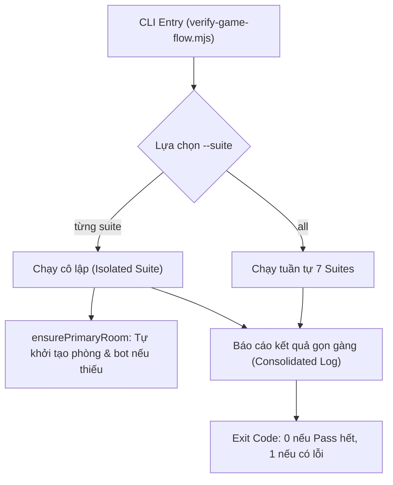

# Token-Saver Automated Testing & Flow Verification (verify-game-flow)

Cẩm nang vận hành kịch bản kiểm thử tự động không giao diện (Headless API Test Runner) dành cho nền tảng **BoardVerse (`partygameonline-platform`)**.

> [!IMPORTANT]
> **Triết lý Tiết kiệm Token (Token-Saver Principle):**
> Việc sử dụng Browser Subagent để thao tác chuột/click trên giao diện web tiêu tốn từ **50.000 đến 80.000 tokens** và mất **2 - 3 phút** cho mỗi kịch bản.
> Ngược lại, bộ kiểm thử tự động qua API trong skill này hoàn thành **29 test cases** chỉ trong **1.5 - 7 giây** và chỉ tiêu hao **~150 tokens** (tiết kiệm hơn **99.8%** token và nhanh gấp **300 lần**).
> **Quy tắc:** Luôn chạy `npm run test:flow` để kiểm tra độ hồi quy (regression) trước khi cân nhắc mở browser.

---

## 1. Lệnh Thực Thi Nhanh (Quick Commands)

```bash
# 1. Chạy toàn bộ 29 Test Cases qua tất cả 7 Suites
npm run test:flow

# 2. Chạy riêng từng Suite theo nhu cầu:
node scripts/verify-game-flow.mjs --suite=catalog    # Kiểm tra danh mục game & manifests
node scripts/verify-game-flow.mjs --suite=auth       # Kiểm tra đăng ký, đăng nhập & JWT session
node scripts/verify-game-flow.mjs --suite=rooms      # Kiểm tra tạo phòng & chốt chặn giới hạn (2P, 8P, 16P, 20P)
node scripts/verify-game-flow.mjs --suite=timers     # Kiểm tra cài đặt thời gian (15s, 30s, 45s)
node scripts/verify-game-flow.mjs --suite=lobby      # Kiểm tra thêm bot, kick bot & chặn phòng đầy
node scripts/verify-game-flow.mjs --suite=gameplay   # Kiểm tra bàn 16 người, chia bài & vai trò cấp cao
node scripts/verify-game-flow.mjs --suite=cleanup    # Kiểm tra đóng phòng & giải phóng tài nguyên
```

---

## 2. Ma Trận Kiểm Thử Chi Tiết (29 Test Cases)

| Suite | Mã TC | Tên Kịch Bản | Kỳ Vọng Kỹ Thuật |
| :--- | :--- | :--- | :--- |
| **Catalog** | `TC-01` | Catalog Health | `GET /api/v1/games` trả về HTTP 200 OK |
| | `TC-02` | Registered Games | Chứa đủ: `blood-bound`, `night-of-bloodlines`, `wheres-the-bone`, `not-in-my-pot` |
| | `TC-03` | Blood Bound Manifest | Sức chứa `minPlayers >= 4`, `maxPlayers = 16` |
| **Auth** | `TC-04` | Dynamic Registration | `POST /api/v1/auth/register` sinh user mới, cấp JWT token hợp lệ |
| | `TC-05` | Login Idempotency | `POST /api/v1/auth/login` xác thực mật khẩu chuẩn xác |
| | `TC-06` | Session Query | `GET /api/v1/session/me` trả về đúng `playerId` và `displayName` |
| **Rooms** | `TC-07` | 16P Room Creation | Tạo phòng thành công với `maxPlayers = 16` |
| | `TC-08` | Underflow Guard | Tạo phòng `maxPlayers = 2` (< 4) bị từ chối với HTTP 400 `INVALID_MAX_PLAYERS` |
| | `TC-09` | Overflow Guard | Tạo phòng `maxPlayers = 20` (> 16) bị từ chối với HTTP 400 `VALIDATION_FAILED` |
| | `TC-10a` | Single Room Guard | Host đang tạo phòng không được tạo thêm phòng khác (HTTP 409 `ALREADY_IN_ROOM`) |
| | `TC-10b` | Medium Room Scale | User khác tạo phòng `maxPlayers = 8` thành công |
| **Timers** | `TC-11` | 30s Turn Timer | `PUT /settings` cập nhật `turnSeconds = 30` |
| | `TC-12` | 45s Turn Timer | `PUT /settings` cập nhật `turnSeconds = 45` |
| | `TC-13` | 15s Turn Timer | `PUT /settings` cập nhật `turnSeconds = 15` |
| | `TC-14` | Intervention Timer | Cửa sổ can thiệp `interventionSeconds = 15` được bảo toàn |
| **Lobby** | `TC-15` | Add Bot | `POST /api/v1/rooms/{id}/bot` thêm bot vào ghế trống thành công |
| | `TC-16` | Kick Bot | `POST /api/v1/rooms/{id}/kick/{botId}` đuổi bot, giảm số lượng người chơi |
| | `TC-17` | Full 16P Seating | Thêm 15 bots để lấp đầy 16/16 ghế (1 Host + 15 Bots) |
| | `TC-18` | Full Room Guard | Cố thêm người thứ 17 bị từ chối với HTTP 409 `ROOM_FULL` |
| | `TC-19` | Min Players Guard | Bắt đầu ván khi phòng mới có 1 người bị từ chối với HTTP 409 `NOT_ENOUGH_PLAYERS` |
| **Gameplay** | `TC-20` | Match Start | Host bắt đầu trận đấu, chuyển trạng thái sang `IN_GAME` |
| | `TC-21` | Snapshot Seats | Bàn đấu có đúng 16 người chơi hoạt động |
| | `TC-22` | Initial Phase | Phase khởi đầu là `LOOK_LEFT` (xem manh mối bí mật người bên trái) |
| | `TC-23` | Secret Card | Host được phát thẻ vai trò hợp lệ: Phe (`ROSE`/`FAN`), Cấp bậc (1 - 8) |
| | `TC-24` | Left Neighbor Clue | Host nhận manh mối hợp lệ của người bên trái (Phe + Phù hiệu Crest) |
| | `TC-25` | 16P Role Presence | Bàn đấu 16 người kích hoạt đủ các vai trò cấp cao: 5 Thuật Sĩ, 6 Hộ Vệ, 7 Cuồng Nộ, 8 Kỹ Nữ |
| | `TC-26` | Look Left Ack | Lệnh `LOOK_LEFT_ACK` của Host được chấp thuận (HTTP 200) |
| **Cleanup** | `TC-27` | Close Room | `POST /api/v1/rooms/{id}/close` trả về HTTP 204 No Content |
| | `TC-28` | Disposed Room | Phòng đã đóng không thể tham gia lại (HTTP 404/409) |

---

## 3. Kiến Trúc Bộ Runner (`scripts/verify-game-flow.mjs`)

Runner được thiết kế theo cấu trúc module độc lập và tự phục hồi (self-sufficient):



### Các hàm cốt lõi:
- `api(path, options)`: Wrapper chuẩn cho `fetch` tự động chèn JWT token, bắt lỗi JSON và xử lý HTTP status code.
- `registerDynamicUser(prefix)`: Tạo tài khoản ngẫu nhiên (`username: prefix_xxxx`, `displayName: p_xxxx` tuân thủ `<= 10` ký tự) để đảm bảo cô lập hoàn toàn giữa các lần test.
- `ensurePrimaryRoom(context)`: Đảm bảo luôn có phòng 16 người sẵn sàng ngay cả khi chạy suite lẻ.

---

## 4. Hướng Dẫn Thêm Test Case Cho Game Mới

Khi phát triển một tựa game mới (ví dụ: `spyfall` hoặc `coup`), hãy mở rộng [scripts/verify-game-flow.mjs](file:///c:/Users/HUNG/.kiro/crew/workspace/boardgames/scripts/verify-game-flow.mjs) theo các bước:

### Bước 1: Thêm Suite hàm mới
```javascript
async function runSpyfallSuite(context) {
  console.log('\n[SUITE: SPYFALL GAMEPLAY]');
  const host = context.host;
  
  // 1. Tạo phòng Spyfall
  const roomRes = await api('/api/v1/rooms', {
    method: 'POST',
    token: host.token,
    body: JSON.stringify({ gameId: 'spyfall', name: 'SpyRoom', maxPlayers: 8, visibility: 'PUBLIC' })
  });
  
  // 2. Thêm bots và bắt đầu
  // 3. Kiểm tra vai trò Gián điệp & Địa điểm bí mật
}
```

### Bước 2: Đăng ký cờ CLI trong `main()`
```javascript
if (targetSuite === 'all' || targetSuite === 'spyfall') await runSpyfallSuite(context);
```

---

## 5. Xử Lý Các Sự Cố Phổ Biến (Troubleshooting)

1. **`Failed to fetch` hoặc `Connection Refused`**:
   - Backend chưa bật. Khởi động backend qua PowerShell: `powershell -ExecutionPolicy Bypass -File apps/server/run.ps1`.
2. **`VALIDATION_FAILED: displayName must be at most 10 characters`**:
   - Chú ý độ dài của `displayName` khi tạo tài khoản kiểm thử: server áp dụng quy tắc chặt chẽ `DisplayNameRules.MAX_LENGTH = 10`.
3. **`ALREADY_IN_ROOM: You are already in a room`**:
   - Nền tảng không cho phép một tài khoản tạo hoặc tham gia nhiều phòng cùng lúc. Sử dụng `registerDynamicUser()` để tạo user riêng biệt cho mỗi kịch bản thử nghiệm đồng thời.
